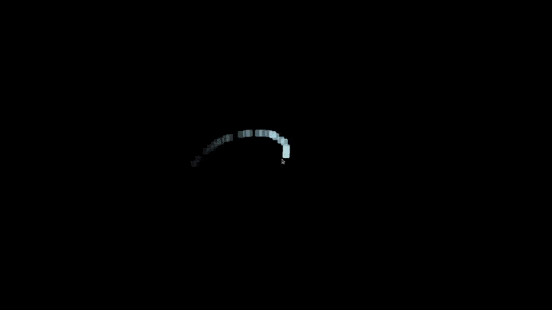
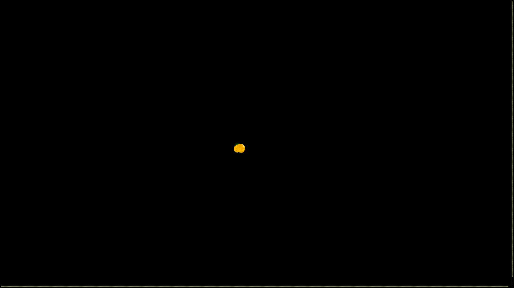

# **Trail**
[](https://www.npmjs.com/package/@dinoly/trail)
[](https://github.com/dinoly/trail/actions/workflows/main.yml)
[](https://github.com/dinoly/trail/blob/main/LICENSE)

[](https://github.com/dinoly/trail/milestone/1)

**NOTE: There are some breaking changes in 0.4.0**

Trail, Generates a trail behind HTMLElement and in HTMLCanvasElement.

look into the [Change log](./CHANGELOG.md) for features and breaking changes

## Content Outline
- [Introduction](#introduction)
- [HTML Trail](#html-trail)
  - [Sample code](#sample-code)
  - [Arguments](#arguments)
  - [Methods](#methods)
- [Canvas Trail](#canvas-trail)
  - [Canvas Sample code](#canvas-sample-code)
  - [Canvas Arguments](#canvas-arguments)
  - [Canvas Methods](#canvas-methods)
- [Gifs](#gifs)
- [Bugs and Future Improvements](#bugs-and-future-improvements)

## Introduction
Place the following `<script>` near the end of your pages, right before the closing `</body>` tag.

```html
<script src="https://cdn.jsdelivr.net/npm/@dinoly/trail@0.4.0/dist/trail.min.js" crossorigin="anonymous"></script>
```
After the above script, make a new trail object and pass in the **class** of the HTMLElement as a `target` parameter.
```html
<script>
  const move = new Trail({
    target: "circle"
  });
  move.followMouse();
</script>
```
Or create trails using Canvas, pass in the **id** of the HTMLCanvasElement as a `area` parameter.
```html
<script>
const can = new CanvasTrail({
  area: "canvas",
  color: "#ffffff50",
  effect: "line"
})
can.followMouse();
</script>
```
## HTML Trail
### Sample code
```html
<!-- index.html -->
<!DOCTYPE html>
<html lang="en" dir="ltr">
<head>
  <meta charset="utf-8">
  <title>Trail</title>
  <link rel="stylesheet" href="./styles.css" /> <!-- Link to the style sheet with circle's custom styling  -->
</head>

<body>
  <div class="circle"></div>
  <script src="https://cdn.jsdelivr.net/npm/@dinoly/trail@0.4.0/dist/trail.min.js" crossorigin="anonymous"></script>
  <script>
    const move = new Trail({
      target: "circle",
    });
    move.followMouse();
  </script>
</body>

</html>
```
```css
/* styles.css */
body {
  margin: 0;
  padding: 0;
  background: black;
  width: 100vw;
  height: 100vh;
}
* {
  cursor: none;
}
.circle {
  background-color: lightblue;
  width: 1.5rem;
  height: 1.5rem;
  border-radius: 50%;
  pointer-events: none;
  margin: 10px; /* will be removed */
}
```

### Arguments
```js
{
  target: null,
  area: null,
  particle: "default", // self
  offset: ['default', 'default'], // 0px
  delay: 50, // in milliseconds
  color: "default", // white
  isnode: true,
  effect: "default", // straight
  trails: false
}
```

| Name         | Description     | code | types |
|--------------|-----------|------------|-------|
| **target** | Is the **class** of the HTMLElement behind which the trail will be generated. | `target: "example"`| none |
| **area** | Is the **class** of the element inside which the trail will be generated. | `area: "example"`| none |
| **particle** | Shape of the particle in trail, default: `self`. Additionally one can provide the particle style instead of **pre-defined types**| `particle: "circle"` or `particle: "height:.3rem;width:.3rem; background-color:salmon;",`| "circle", "triangle", "square" |
| **offset** | Offsets the trail from origin | `color: "mediumseagreen"`| none |
| **color** | Color of the trail. Can be a gradient | `color: "#ffffff50"` or `color: [[0,"orange"], [30,"white"], [50, "green"]]`| none |
| **delay** | Delay particle emission | `delay: 1000 // 1s`| none |
| **isnode** | Set `false` if you want a trail for a **Text** or **Svg**, default: `true` | `isnode:false`| none |
| **effect** | Behavior of the particle | `effect:"spread"`| "spread", "rotate" |
| **trails** | If `true` will create trails with multiple particles, currently `2`. | `trails:true`| none |


Note: if this `trails:true` creates a lag, use the `effect: "spread"` which will create similar effect with one particle.


### Methods
| Name         | Description     | code
|--------------|   -----------   |------------|
| **followMouse** | Make the Html element follow the **Mouse Pointer** with a trail. | `Trail.followMouse();` |
| **followNode** | Does not make the Html element follow the **Mouse Pointer**, add CSS to move the element how ever you like. | `Trail.followNode();` |
| **activeArea** | make the Html element follow the **Mouse Pointer** when mouse hover a certain element, set with `area: <class-of-area>` | `Trail.activeArea();` |

## Canvas Trail
### Canvas sample code
```html
<!-- index.html -->
<!DOCTYPE html>
<html lang="en" dir="ltr">
<head>
  <meta charset="utf-8">
  <title>Trail</title>
  <link rel="stylesheet" href="./styles.css" /> <!-- Link to the style sheet with circle's custom styling  -->
</head>

<body>
  <canvas id="canvas"></canvas>
  <script src="https://cdn.jsdelivr.net/npm/@dinoly/trail@0.4.0/dist/trail.min.js" crossorigin="anonymous"></script>
  <script>
  const can = new CanvasTrail({
    area: "canvas",
    color: "#ffffff50",
    effect: "paint"
  })
  can.followMouse();
  </script>
</body>

</html>
```
```css
/* styles.css */
body {
  margin: 0;
  padding: 0;
  background: black;
  width: 100vw;
  height: 100vh;
}
* {
  cursor: none;
}
#canvas {
  width: 100%;
  height: 100%;
  background: linear-gradient(#25364f, #4d71a5, #9bc4ff);
}
```


### Canvas Arguments
```js
{
  area: "canvas",
  color: "#ffffff50",
  effect: "line"
}
```

| Name         | Description     | code | types |
|--------------|-----------|------------|-------|
| **area** | Is the **id** of the HTMLCanvasElement inside which the trail will be generated. | `area: "canvas"`| none |
| **color** | Color of the trail | `effect:"spread"`| none |
| **effect** | Behavior of the trail | `effect:"paint"`| "default", "paint", "web", "line" |


Note: if this `trails:true` creates a lag, use the `effect: "spread"` which will create similar effect with one particle.


### Canvas Methods
| Name         | Description     | code
|--------------|   -----------   |------------|
| **followMouse** | Make the HTMLCanvasElement follow the **Mouse Pointer** with a trail. | `CanvasTrail.followMouse();` |

### Gifs
<div style="display:flex;flex-direction:row;width:400px;">
  
  
  
  
</div>

### Bugs and Future Improvements
Improvements
- Resizing the trail.
- Trail behind multiple elements with one `Trail` object.
- More Effects and Particles.
- Support for nested elements.
